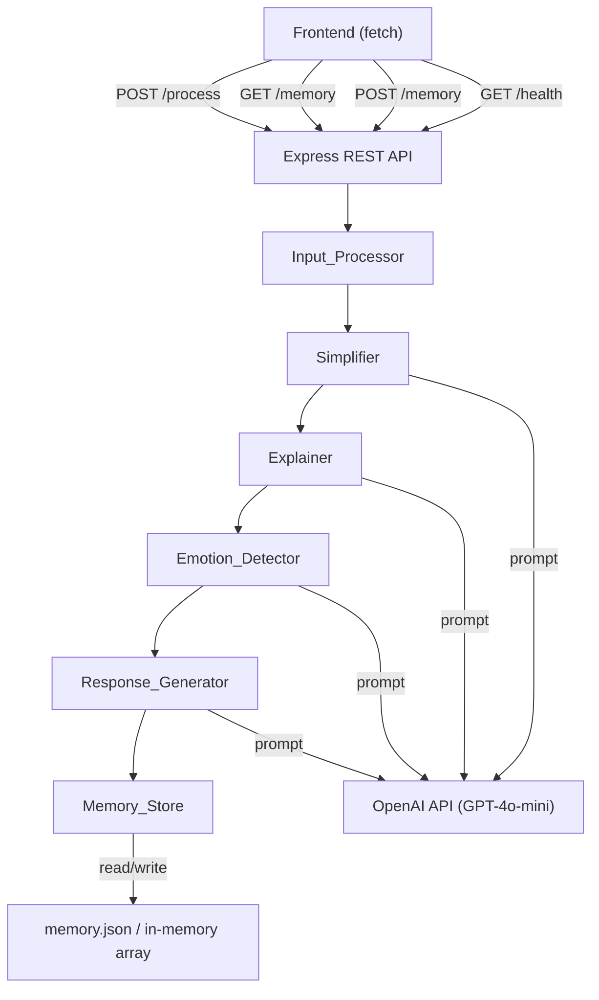

# Design Document: Clarity AI Cognitive Copilot

## Overview

Clarity is a backend REST API that runs user-submitted text through a multi-stage AI pipeline to produce simplified, emotionally-aware, supportive responses for people with cognitive challenges. Each interaction is stored in a memory timeline that caregivers can query later.

The system is designed for a ~10-hour hackathon build. The architecture prioritizes simplicity, modularity, and demo-ability over production-scale concerns.

**Technology Stack:**
- **Runtime**: Node.js (v18+) with Express.js
- **Language**: JavaScript (ESM or CommonJS)
- **LLM API**: OpenAI API (GPT-4o-mini for cost/speed balance)
- **Storage**: In-memory (default) or JSON file, toggled via `STORAGE_TYPE` env var
- **Testing**: Jest (unit) + fast-check (property-based testing)
- **HTTP Client**: Native `fetch` (Node 18+) for LLM calls

Rationale: Express is minimal and fast to scaffold. GPT-4o-mini gives strong instruction-following at low latency and cost, critical for a live demo. fast-check is the leading JS property-based testing library.

---

## Architecture



Each pipeline stage is a pure async function that receives a context object and returns an enriched version of it. The API layer orchestrates the pipeline and handles HTTP concerns.

---

## File / Folder Structure

```
clarity-backend/
├── src/
│   ├── server.js              # Express app setup, middleware, route mounting
│   ├── routes/
│   │   ├── process.js         # POST /process
│   │   ├── memory.js          # GET /memory, POST /memory
│   │   └── health.js          # GET /health
│   ├── pipeline/
│   │   ├── index.js           # Orchestrates stage execution in order
│   │   ├── inputProcessor.js  # Stage 1: normalize input
│   │   ├── simplifier.js      # Stage 2: LLM simplification
│   │   ├── explainer.js       # Stage 3: LLM explanation
│   │   ├── emotionDetector.js # Stage 4: LLM emotion classification
│   │   └── responseGenerator.js # Stage 5: LLM supportive response
│   ├── storage/
│   │   ├── index.js           # Factory: returns in-memory or file store
│   │   ├── memoryStore.js     # In-memory array implementation
│   │   └── fileStore.js       # JSON file implementation
│   └── llm.js                 # Shared LLM call wrapper (fetch + error handling)
├── tests/
│   ├── unit/
│   │   ├── inputProcessor.test.js
│   │   ├── storage.test.js
│   │   └── routes.test.js
│   └── property/
│       ├── pipeline.property.test.js
│       └── storage.property.test.js
├── memory.json                # Created at runtime if file storage is used
├── .env                       # OPENAI_API_KEY, STORAGE_TYPE, PORT
└── package.json
```

---

## Components and Interfaces

### Express App (`server.js`)

Mounts routes, applies JSON body parsing, and attaches a request-logging middleware.

```js
// Request logger middleware
app.use((req, res, next) => {
  res.on('finish', () => console.log(`${req.method} ${req.path} ${res.statusCode}`));
  next();
});
```

### Pipeline Orchestrator (`pipeline/index.js`)

```js
// Context object shape flowing through the pipeline
{
  original_text: string,      // set by Input_Processor
  normalized_text: string,    // set by Input_Processor
  simplified_text: string,    // set by Simplifier
  explanation: string,        // set by Explainer
  emotion: 'confused' | 'stressed' | 'neutral',  // set by Emotion_Detector
  response: string            // set by Response_Generator
}
```

Each stage receives the full context and returns it with its field(s) added. If a stage throws, the orchestrator catches it and re-throws with the stage name attached so the route handler can return a 502 with the right message.

```js
async function runPipeline(text) {
  let ctx = {};
  const stages = [inputProcessor, simplifier, explainer, emotionDetector, responseGenerator];
  for (const stage of stages) {
    ctx = await stage(ctx);  // throws PipelineError on LLM failure
  }
  return ctx;
}
```

### LLM Wrapper (`llm.js`)

Single function used by all LLM-backed stages. Handles auth, retries (1 retry on 429), and throws a typed error on failure.

```js
async function callLLM(systemPrompt, userContent) {
  // POST to https://api.openai.com/v1/chat/completions
  // model: "gpt-4o-mini", temperature: 0.3
  // Returns: response text string
  // Throws: LLMError with { message, stageName }
}
```

### Pipeline Stages

#### Stage 1 — Input_Processor (`inputProcessor.js`)
Pure function, no LLM call.

```js
function inputProcessor(ctx) {
  const normalized = ctx.raw_text.trim();
  return { ...ctx, original_text: ctx.raw_text, normalized_text: normalized };
}
```

#### Stage 2 — Simplifier (`simplifier.js`)

System prompt:
```
You are a text simplification assistant helping people with cognitive challenges.
Rewrite the following text at a grade 5 reading level or below.
Preserve all factual content and meaning. Use short sentences and simple words.
If the text is already simple, return it with minimal changes.
Respond with ONLY the simplified text, no preamble.
```

User content: `ctx.normalized_text`

#### Stage 3 — Explainer (`explainer.js`)

System prompt:
```
You are a vocabulary assistant helping people with cognitive challenges.
Identify any words or phrases in the following text that might be unfamiliar or hard to understand.
Explain them in plain language at a grade 5 reading level.
Format your response as: "Word/phrase: plain explanation." on separate lines.
If there are no complex terms, respond with: "No complex terms found."
Respond with ONLY the explanations, no preamble.
```

User content: `ctx.normalized_text`

#### Stage 4 — Emotion_Detector (`emotionDetector.js`)

System prompt:
```
You are an emotion classifier for a cognitive support system.
Classify the emotional/cognitive state of the following text.
You MUST respond with exactly one word: confused, stressed, or neutral.
- confused: repeated questions, uncertainty, fragmented thoughts
- stressed: urgency, distress, overwhelm indicators
- neutral: calm, clear, no distress signals
Respond with ONLY the single word label.
```

User content: `ctx.normalized_text`

Response is lowercased and validated against `['confused', 'stressed', 'neutral']`. If the LLM returns something unexpected, default to `'neutral'` and log a warning.

#### Stage 5 — Response_Generator (`responseGenerator.js`)

System prompt:
```
You are a compassionate cognitive support assistant.
You will receive context about a user's message and their emotional state.
Generate a warm, supportive reply (2-4 sentences) appropriate to their emotional state:
- confused: reassure them, offer to clarify, keep it simple
- stressed: acknowledge their stress, encourage calm, be gentle
- neutral: be warm and affirming
Use the simplified text and explanations as context for your reply.
Respond with ONLY the supportive message, no preamble.
```

User content:
```
Emotional state: {emotion}
Original message: {normalized_text}
Simplified version: {simplified_text}
Key explanations: {explanation}
```

### Storage Layer (`storage/`)

The factory in `storage/index.js` reads `process.env.STORAGE_TYPE` (default: `'memory'`) and returns either the in-memory or file store. Both implement the same interface:

```js
// Storage interface
{
  save(interaction): Promise<Interaction>,   // assigns id + timestamp, persists
  getAll(): Promise<Interaction[]>,          // all records, newest first
  getByDate(dateStr): Promise<Interaction[]> // filter by YYYY-MM-DD UTC date
}
```

**In-memory store**: plain JS array, `id` is `crypto.randomUUID()`.

**File store**: reads/writes `memory.json` as a JSON array. Writes are synchronous (`writeFileSync`) to keep it simple for the hackathon.

---

## Data Models

### Interaction Record

```json
{
  "id": "550e8400-e29b-41d4-a716-446655440000",
  "original_text": "The doctor said I need to take my medication twice daily with food.",
  "simplified_text": "The doctor wants you to take your medicine two times a day. Eat food when you take it.",
  "explanation": "medication: medicine you take to stay healthy or treat an illness.",
  "emotion": "neutral",
  "response": "That sounds straightforward. You're doing great by keeping track of your health.",
  "timestamp": "2024-01-15T14:32:00.000Z"
}
```

### POST /process Request Body

```json
{
  "text": "string (1–2000 characters, required)"
}
```

### POST /process Response (200)

```json
{
  "id": "uuid",
  "original_text": "string",
  "simplified_text": "string",
  "explanation": "string",
  "emotion": "confused | stressed | neutral",
  "response": "string",
  "timestamp": "ISO 8601 UTC string"
}
```

### GET /memory Response (200)

```json
[
  { /* Interaction */ },
  { /* Interaction */ }
]
```

### GET /health Response (200)

```json
{ "status": "ok" }
```

### Error Response (4xx / 5xx)

```json
{ "error": "Human-readable description of what went wrong." }
```

### Emotion Label Enum

```
'confused' | 'stressed' | 'neutral'
```

---


## Correctness Properties

*A property is a characteristic or behavior that should hold true across all valid executions of a system — essentially, a formal statement about what the system should do. Properties serve as the bridge between human-readable specifications and machine-verifiable correctness guarantees.*

### Property 1: Valid /process response contains all required fields

*For any* non-empty text string (≤ 2000 characters), a POST to `/process` should return HTTP 200 with a JSON body containing all of: `id`, `original_text`, `simplified_text`, `explanation`, `emotion`, `response`, and `timestamp`.

**Validates: Requirements 1.1, 2.4, 3.4, 4.3, 5.6**

---

### Property 2: Empty or missing text is rejected with 400

*For any* POST `/process` request where the `text` field is absent, an empty string, or composed entirely of whitespace, the system should return HTTP 400 with a JSON body containing an `error` field.

**Validates: Requirements 1.2**

---

### Property 3: Input normalization trims whitespace

*For any* string with leading or trailing whitespace, the `original_text` in the stored interaction should equal the raw input, while the pipeline processes the trimmed version (verified by checking `original_text` is preserved and the pipeline does not fail on whitespace-padded inputs).

**Validates: Requirements 1.4**

---

### Property 4: Emotion label is always a valid enum value

*For any* valid text input, the `emotion` field in the `/process` response must be exactly one of `"confused"`, `"stressed"`, or `"neutral"` — never any other value.

**Validates: Requirements 4.1**

---

### Property 5: Pipeline stage failure returns 502 with stage name

*For any* pipeline stage (Simplifier, Explainer, Emotion_Detector, Response_Generator), when that stage's LLM call fails, the system should return HTTP 502 with a JSON body whose `error` field identifies the failing stage by name.

**Validates: Requirements 6.2**

---

### Property 6: Storage round-trip preserves all interaction fields

*For any* interaction object saved to the Memory_Store (either in-memory or file-based), retrieving it via `getAll()` should return a record with all original fields intact, plus a unique UUID `id` and a valid ISO 8601 UTC `timestamp` string.

**Validates: Requirements 7.1, 7.2, 7.3**

---

### Property 7: All stored interaction IDs are unique

*For any* sequence of interactions saved to the Memory_Store, no two records should share the same `id` value.

**Validates: Requirements 7.2**

---

### Property 8: Both storage backends satisfy the same interface contract

*For any* sequence of save and retrieve operations, the in-memory store and the file-based store should produce identical results — same records, same ordering, same field values.

**Validates: Requirements 7.4**

---

### Property 9: GET /memory returns records sorted newest-first

*For any* collection of stored interactions with distinct timestamps, the array returned by GET `/memory` should be ordered by `timestamp` descending (most recent first).

**Validates: Requirements 8.1**

---

### Property 10: Date filter returns only matching records

*For any* valid `YYYY-MM-DD` date string passed as the `date` query parameter to GET `/memory`, every record in the returned array should have a `timestamp` whose UTC calendar date equals the requested date, and no records from other dates should appear.

**Validates: Requirements 8.2**

---

### Property 11: Invalid date format returns 400

*For any* string passed as the `date` query parameter that does not match the `YYYY-MM-DD` format (e.g., wrong separators, wrong field order, non-numeric characters), the system should return HTTP 400 with a JSON error body.

**Validates: Requirements 8.4**

---

### Property 12: All error responses are JSON with an error field

*For any* request that causes an error response (400, 502, etc.), the response body should be a valid JSON object containing at least an `error` field with a non-empty string value.

**Validates: Requirements 10.2**

---

### Property 13: POST /memory with invalid emotion returns 400

*For any* string value for the `emotion` field that is not one of `"confused"`, `"stressed"`, or `"neutral"`, a POST to `/memory` should return HTTP 400 with a JSON error body.

**Validates: Requirements 9.3**

---

### Property 14: POST /memory with missing required fields returns 400

*For any* POST `/memory` request body that is missing one or more of the required fields (`original_text`, `simplified_text`, `explanation`, `emotion`, `response`), the system should return HTTP 400 with a JSON error body.

**Validates: Requirements 9.2**

---

## Error Handling

| Scenario | HTTP Status | Response |
|---|---|---|
| Missing or empty `text` in POST /process | 400 | `{ "error": "text field is required and must be non-empty" }` |
| `text` exceeds 2000 characters | 400 | `{ "error": "text field must not exceed 2000 characters" }` |
| LLM API failure in any stage | 502 | `{ "error": "Pipeline stage 'Simplifier' failed: <reason>" }` |
| Invalid `date` query param format | 400 | `{ "error": "date must be in YYYY-MM-DD format" }` |
| POST /memory missing required fields | 400 | `{ "error": "Missing required fields: original_text, emotion" }` |
| POST /memory invalid emotion value | 400 | `{ "error": "emotion must be one of: confused, stressed, neutral" }` |
| Memory_Store write failure | logs error, returns 200 | Pipeline response still returned to caller |
| Unhandled exception | 500 | `{ "error": "Internal server error" }` |

**Pipeline error propagation:**

```js
class PipelineError extends Error {
  constructor(stageName, cause) {
    super(`Pipeline stage '${stageName}' failed: ${cause.message}`);
    this.stageName = stageName;
    this.cause = cause;
  }
}
```

Each LLM-backed stage wraps its `callLLM()` invocation in a try/catch and re-throws as `PipelineError`. The route handler catches `PipelineError` and returns 502; all other errors return 500.

---

## Testing Strategy

### Dual Testing Approach

Both unit tests and property-based tests are required. They are complementary:
- Unit tests catch concrete bugs at specific inputs and integration points
- Property tests verify universal correctness across randomized inputs

### Unit Tests (Jest)

Focus areas:
- `inputProcessor.js`: trimming behavior, empty string handling
- `storage/memoryStore.js` and `storage/fileStore.js`: save/retrieve/filter operations
- Route handlers: specific request/response examples, error path coverage
- `llm.js`: mock OpenAI responses, verify retry on 429, verify error propagation

Key example tests:
- GET /health returns `{ status: "ok" }` with 200
- POST /process with storage failure still returns 200 with pipeline result
- GET /memory with no records returns `[]` with 200
- Request logger writes `METHOD /path STATUS` to stdout

### Property-Based Tests (fast-check)

Library: **fast-check** (`npm install --save-dev fast-check`)

Each property test runs a minimum of **100 iterations** (fast-check default is 100; set `numRuns: 100` explicitly).

Each test is tagged with a comment in the format:
`// Feature: clarity-ai-cognitive-copilot, Property N: <property_text>`

**Property test file: `tests/property/storage.property.test.js`**

```js
// Feature: clarity-ai-cognitive-copilot, Property 6: Storage round-trip preserves all interaction fields
test('storage round-trip preserves all fields', async () => {
  await fc.assert(fc.asyncProperty(
    fc.record({
      original_text: fc.string({ minLength: 1 }),
      simplified_text: fc.string({ minLength: 1 }),
      explanation: fc.string({ minLength: 1 }),
      emotion: fc.constantFrom('confused', 'stressed', 'neutral'),
      response: fc.string({ minLength: 1 }),
    }),
    async (interaction) => {
      const store = createMemoryStore();
      const saved = await store.save(interaction);
      const all = await store.getAll();
      const found = all.find(r => r.id === saved.id);
      expect(found).toMatchObject(interaction);
      expect(found.id).toMatch(/^[0-9a-f-]{36}$/); // UUID
      expect(new Date(found.timestamp).toISOString()).toBe(found.timestamp); // valid ISO 8601
    }
  ), { numRuns: 100 });
});
```

**Property test file: `tests/property/pipeline.property.test.js`**

```js
// Feature: clarity-ai-cognitive-copilot, Property 4: Emotion label is always a valid enum value
test('emotion is always a valid label', async () => {
  await fc.assert(fc.asyncProperty(
    fc.string({ minLength: 1, maxLength: 200 }),
    async (text) => {
      // Uses mocked LLM that returns valid responses
      const result = await runPipeline(text);
      expect(['confused', 'stressed', 'neutral']).toContain(result.emotion);
    }
  ), { numRuns: 100 });
});
```

**Mapping of Properties to Tests:**

| Property | Test File | Test Description |
|---|---|---|
| 1 | pipeline.property.test.js | Valid input produces response with all required fields |
| 2 | pipeline.property.test.js | Empty/whitespace text returns 400 |
| 3 | pipeline.property.test.js | Whitespace-padded input is normalized |
| 4 | pipeline.property.test.js | Emotion is always a valid enum value |
| 5 | pipeline.property.test.js | Stage failure returns 502 with stage name |
| 6 | storage.property.test.js | Storage round-trip preserves all fields |
| 7 | storage.property.test.js | All stored IDs are unique |
| 8 | storage.property.test.js | Both storage backends produce identical results |
| 9 | storage.property.test.js | GET /memory returns records sorted newest-first |
| 10 | storage.property.test.js | Date filter returns only matching records |
| 11 | routes.property.test.js | Invalid date format returns 400 |
| 12 | routes.property.test.js | All error responses contain error field |
| 13 | routes.property.test.js | Invalid emotion in POST /memory returns 400 |
| 14 | routes.property.test.js | Missing fields in POST /memory returns 400 |
