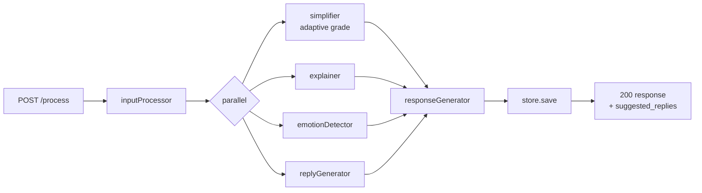
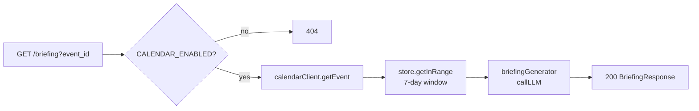

# Design Document: Clarity Enhancements

## Overview

This document describes the technical design for six enhancements to the Clarity AI Cognitive Copilot. The system helps autistic users navigate real-time conversations by simplifying language, detecting emotion, and providing supportive responses.

The enhancements are:
1. Real-Time Color Flash — visual cue on camera view when confusion is detected
2. Post-Call Summaries — LLM-generated recap after a session ends
3. Suggested Replies — 1–3 short reply chips shown in the overlay
4. Adaptive Simplification — grade level adjusts based on user stress state
5. Multi-Speaker Labeling — per-speaker color accents in overlay and timeline
6. Calendar / Meeting Prep Integration — pre-call briefing from memory history

All changes build on the existing pipeline (`inputProcessor → [simplifier, explainer, emotionDetector] → responseGenerator`), the Express backend, and the single-page vanilla JS frontend.

---

## Architecture

### Backend Changes

```
POST /process
  body: { text, user_emotion?, speaker_label? }
  pipeline: inputProcessor
           → [simplifier(adaptive), explainer, emotionDetector, replyGenerator]  ← parallel
           → responseGenerator
  store: save with speaker_label, suggested_replies

POST /summary
  body: { interaction_ids: string[] }
  handler: summaryGenerator(records) → store.save({ type:"summary", ... })

GET /briefing?event_id=   (CALENDAR_ENABLED=true only)
  handler: calendarClient.getEvent → briefingGenerator(event, memoryRecords)
```

### New Pipeline Stages

- `replyGenerator` — added to the parallel stage alongside simplifier/explainer/emotionDetector
- `summaryGenerator` — standalone function called by the `/summary` route (not part of the per-utterance pipeline)
- `briefingGenerator` — standalone function called by the `/briefing` route

### Frontend Changes

- `processText()` — include `user_emotion` and `speaker_label` in POST body
- `showOverlay()` — render suggested reply chips; render speaker label; trigger color flash
- `toggleMic()` — on stop, collect session IDs and POST `/summary`
- Memory timeline — render summary records distinctly; render speaker labels
- Top bar — add "📅 Prep" button when `CALENDAR_ENABLED` is detected

---

## Components and Interfaces

### 1. `replyGenerator` (new pipeline stage)

```js
// src/pipeline/replyGenerator.js
export async function replyGenerator(ctx)
// Input:  ctx.normalized_text, ctx.emotion, ctx.simplified_text
// Output: { ...ctx, suggested_replies: string[] }  (1–3 items, each ≤20 words)
// On LLM JSON parse failure: returns { ...ctx, suggested_replies: [] } + console.warn
```

System prompt instructs the LLM to return a JSON array of strings. The stage parses the response with `JSON.parse`; on failure it logs a warning and returns `[]`.

### 2. `summaryGenerator` (standalone)

```js
// src/pipeline/summaryGenerator.js
export async function summaryGenerator(records)
// Input:  InteractionRecord[]
// Output: { recap, dominant_emotion, confused_moments: string[] }
// Throws: PipelineError('Summary_Generator', cause) on LLM failure
```

Computes `dominant_emotion` by frequency count over `records[].emotion`. Passes concatenated `original_text` + emotion labels to `callLLM`. Instructs LLM to return JSON with `recap` (string), `dominant_emotion` (string), `confused_moments` (string[], max 5).

### 3. `briefingGenerator` (standalone)

```js
// src/pipeline/briefingGenerator.js
export async function briefingGenerator(event, records)
// Input:  event: { event_id, event_title, event_start }, records: InteractionRecord[]
// Output: { event_id, event_title, event_start, briefing_text, dominant_emotion, suggested_topics: string[] }
// Throws: PipelineError('Briefing_Generator', cause) on LLM failure
```

### 4. `calendarClient` (new utility)

```js
// src/calendar/calendarClient.js
export async function getEvent(eventId)
// Reads CALENDAR_PROVIDER and CALENDAR_API_KEY from env
// Returns: { event_id, event_title, event_start }
// Throws: CalendarError on provider API failure
```

Initial implementation supports a generic REST calendar provider. The provider URL is constructed from `CALENDAR_PROVIDER`.

### 5. Updated `simplifier`

The `simplifier` stage reads `ctx.simplification_level` (set by the route handler from `user_emotion`) and builds the system prompt dynamically:

```js
const grade = ctx.simplification_level === 3 ? 'grade 3' : 'grade 5';
// system prompt: `Rewrite at a ${grade} reading level or below.`
```

### 6. Updated `runPipeline`

```js
export async function runPipeline(text, options = {})
// options: { user_emotion?, speaker_label? }
// Injects simplification_level into ctx before parallel stage
// Merges suggested_replies from replyGenerator
// Propagates speaker_label through ctx unchanged
```

### 7. Updated `/process` route

```js
// Reads user_emotion, speaker_label from req.body
// Validates speaker_label length ≤ 50 chars → 400 if exceeded
// Passes options to runPipeline
// Stores result (includes speaker_label, suggested_replies)
```

### 8. New `/summary` route

```js
// POST /summary  { interaction_ids: string[] }
// Fetches records by ID from store
// Calls summaryGenerator(records)
// Saves { type:"summary", recap, dominant_emotion, confused_moments }
// Returns 201 with saved record
// 400 if interaction_ids is empty
// 502 on LLM failure
```

### 9. New `/briefing` route

```js
// GET /briefing?event_id=
// 404 if CALENDAR_ENABLED !== "true"
// Calls calendarClient.getEvent(event_id)
// Queries store for records within 7 days before event_start
// Calls briefingGenerator(event, records)
// Returns 200 with briefing object
// 502 on calendar or LLM failure
```

### 10. Storage — `getByIds` and `getInRange`

Two new methods added to both `memoryStore` and `fileStore`:

```js
getByIds(ids: string[]): InteractionRecord[]
getInRange(from: string, to: string): InteractionRecord[]  // ISO date strings
```

---

## Data Models

### Updated `InteractionRecord`

```ts
{
  id: string               // UUID, assigned by store
  timestamp: string        // ISO 8601
  original_text: string
  normalized_text: string
  simplified_text: string
  explanation: string
  emotion: string          // one of 10 valid labels
  response: string
  suggested_replies: string[]   // NEW — array of 1–3 strings
  speaker_label?: string        // NEW — optional, max 50 chars
  simplification_level?: 3 | 5  // NEW — stored for audit
}
```

### `SummaryRecord`

```ts
{
  id: string
  timestamp: string
  type: "summary"
  recap: string                  // 2–4 sentences
  dominant_emotion: string       // most frequent emotion in session
  confused_moments: string[]     // up to 5 original_text excerpts
}
```

### `BriefingResponse` (not stored, returned directly)

```ts
{
  event_id: string
  event_title: string
  event_start: string            // ISO 8601
  briefing_text: string          // 2–3 sentence context summary
  dominant_emotion: string
  suggested_topics: string[]     // 2–4 topics
}
```

### `/process` Request Body

```ts
{
  text: string                   // required, 1–2000 chars
  user_emotion?: string          // optional; unrecognized → treated as absent
  speaker_label?: string         // optional; max 50 chars
}
```

### `/summary` Request Body

```ts
{
  interaction_ids: string[]      // required, non-empty
}
```

---

## Frontend UI Changes

### Color Flash (Requirement 1)

A new `<div id="colorFlash">` is added as a fixed overlay on the camera view (z-index between camera and overlay panel). It is amber (`rgba(251,191,36,0.35)`) with a CSS transition for fade-in/fade-out.

Logic in `showOverlay(data)`:
```js
const confusionSignal =
  ['confused','stressed'].includes(data.emotion) ||
  (data.explanation && data.explanation !== 'No complex terms found.');

if (confusionSignal && !overlayVisible) {
  showColorFlash();  // fades in, auto-dismisses after 4s
}
```

Clicking the flash calls `openOverlay()`. The flash is not shown if the overlay is already open.

### Suggested Replies (Requirement 3)

A new `.ov-card.replies` card is appended to `#overlay`. It renders `data.suggested_replies` as `<button class="reply-chip">` elements. Chips are tappable; clicking a chip copies the text to clipboard (or pre-populates a future send field).

### Speaker Label (Requirement 5)

- `showOverlay(data)` renders `data.speaker_label` in a small label above the simplified text card if present.
- A `speakerColors` map (up to 6 entries) assigns a CSS accent color per label per session. Colors cycle through a predefined palette.
- Memory timeline items show the speaker label badge alongside the emotion badge.

### Session Tracking & Post-Call Summary (Requirement 2)

- `sessionInteractionIds: string[]` accumulates `data.id` from each `/process` response during a session.
- When `toggleMic()` stops the session (autoMode → false), if `sessionInteractionIds.length > 0`, the frontend POSTs to `/summary` and displays the result in the memory panel.
- Summary records in the memory timeline are rendered with a `📋 Summary` header and distinct background.

### Adaptive Simplification (Requirement 4)

`processText(text)` reads `currentBlendedEmotion` (computed from voice + face blend) and includes it as `user_emotion` in the POST body.

### Calendar Prep Button (Requirement 6)

- On init, if `CALENDAR_ENABLED` is detected (via a `/health` or config endpoint, or a frontend env flag), a `<button id="prepBtn">📅 Prep</button>` is added to the top bar.
- A 60-second polling interval checks for upcoming meetings (via `GET /briefing?event_id=...`).
- When a meeting is found within 60 minutes, the button pulses and clicking it opens a briefing panel.
- Suggested topics from the briefing are rendered as chips that populate the reply chips area.

---

## Mermaid Diagrams

### Updated Pipeline Flow



### Summary Flow


### Briefing Flow



---

## Correctness Properties

*A property is a characteristic or behavior that should hold true across all valid executions of a system — essentially, a formal statement about what the system should do. Properties serve as the bridge between human-readable specifications and machine-verifiable correctness guarantees.*


### Property 1: Confusion Signal is computed correctly

*For any* combination of `emotion` value and `explanation` string returned by the pipeline, the `confusionSignal` flag should be `true` if and only if the emotion is `"confused"` or `"stressed"`, OR the explanation string is not equal to `"No complex terms found."`.

**Validates: Requirements 1.7**

### Property 2: Summary output has required structure

*For any* non-empty array of `InteractionRecord` objects passed to `summaryGenerator`, the returned object should contain a non-empty `recap` string, a `dominant_emotion` string that is one of the 10 valid emotion labels, and a `confused_moments` array of at most 5 strings.

**Validates: Requirements 2.2**

### Property 3: Summary is stored with type "summary"

*For any* valid POST `/summary` request with a non-empty `interaction_ids` array, the record saved to the Memory_Store should have `type` equal to `"summary"` and contain `recap`, `dominant_emotion`, and `confused_moments` fields.

**Validates: Requirements 2.4, 2.8**

### Property 4: Reply count is within bounds

*For any* valid pipeline context (non-empty `normalized_text`, valid `emotion`, non-empty `simplified_text`), the `suggested_replies` array returned by `replyGenerator` should contain between 1 and 3 items inclusive.

**Validates: Requirements 3.1, 3.4**

### Property 5: Each suggested reply is at most 20 words

*For any* `suggested_replies` array returned by `replyGenerator`, every string in the array should contain 20 words or fewer when split on whitespace.

**Validates: Requirements 3.3**

### Property 6: Simplification level maps correctly from user_emotion

*For any* `user_emotion` value passed to the pipeline, the `simplification_level` injected into the pipeline context should be `3` when `user_emotion` is `"confused"`, `"stressed"`, or `"anxious"`, and `5` for all other values (including absent, `null`, or unrecognized strings).

**Validates: Requirements 4.2, 4.3, 4.7**

### Property 7: Speaker label is propagated unchanged

*For any* POST `/process` request that includes a `speaker_label` string of 50 characters or fewer, the stored `InteractionRecord` should contain a `speaker_label` field equal to the value sent in the request. For any request that omits `speaker_label`, the stored record should not contain a `speaker_label` field.

**Validates: Requirements 5.2, 5.6**

### Property 8: Briefing memory window is correct

*For any* calendar event with a given `event_start` timestamp, all `InteractionRecord` objects passed to `briefingGenerator` should have `timestamp` values within the 7-day window ending at `event_start` (i.e., `event_start - 7 days ≤ record.timestamp ≤ event_start`).

**Validates: Requirements 6.3**

### Property 9: Briefing output has required structure

*For any* calendar event object and any array of `InteractionRecord` objects (including an empty array), the object returned by `briefingGenerator` should contain non-empty `briefing_text`, `dominant_emotion`, and `suggested_topics` (array of 2–4 strings), plus the `event_id`, `event_title`, and `event_start` echoed from the input event.

**Validates: Requirements 6.4, 6.5, 6.8**

---

## Error Handling

### Backend

| Scenario | HTTP Status | Response |
|---|---|---|
| `text` missing or empty on POST /process | 400 | `{ error: "text field is required..." }` |
| `speaker_label` > 50 chars on POST /process | 400 | `{ error: "speaker_label must not exceed 50 characters" }` |
| Pipeline LLM failure | 502 | `{ error: "Pipeline stage X failed: ..." }` |
| `interaction_ids` empty on POST /summary | 400 | `{ error: "interaction_ids must be a non-empty array" }` |
| `callLLM` failure in summaryGenerator | 502 | `{ error: "Summary_Generator failed: ..." }` |
| `CALENDAR_ENABLED` not `"true"` on GET /briefing | 404 | `{ error: "Calendar integration is not enabled" }` |
| Calendar provider API error | 502 | `{ error: "Calendar provider error: ..." }` |
| `callLLM` failure in briefingGenerator | 502 | `{ error: "Briefing_Generator failed: ..." }` |
| `replyGenerator` JSON parse failure | — | Returns `[]`, logs warning, pipeline continues |

### Frontend

- Color flash is suppressed if overlay is already open (no duplicate flash)
- If POST `/summary` fails, the error is silently logged (session end should not block the user)
- If GET `/briefing` fails, the Prep button shows a toast error and remains clickable
- Unrecognized `user_emotion` values are passed through; the backend defaults to grade 5

---

## Testing Strategy

### Dual Testing Approach

Both unit tests and property-based tests are required. Unit tests cover specific examples, integration points, and error conditions. Property tests verify universal correctness across randomized inputs.

### Property-Based Testing

Library: **fast-check** (already available in the Node.js ecosystem, works with Vitest/Jest).

Each property test runs a minimum of **100 iterations**. Each test is tagged with a comment referencing the design property:

```
// Feature: clarity-enhancements, Property N: <property_text>
```

Each correctness property above maps to exactly one property-based test:

| Property | Test file | fast-check arbitraries |
|---|---|---|
| P1: Confusion signal | `tests/property/confusionSignal.test.js` | `fc.string()`, `fc.constantFrom(...emotions)` |
| P2: Summary structure | `tests/property/summaryGenerator.test.js` | `fc.array(fc.record({...}), {minLength:1})` |
| P3: Summary stored with type | `tests/property/summaryRoute.test.js` | `fc.array(fc.record({...}), {minLength:1})` |
| P4: Reply count bounds | `tests/property/replyGenerator.test.js` | `fc.string({minLength:1})`, `fc.constantFrom(...emotions)` |
| P5: Reply word length | `tests/property/replyGenerator.test.js` | same as P4 |
| P6: Simplification level mapping | `tests/property/simplifier.test.js` | `fc.option(fc.constantFrom(...emotions))` |
| P7: Speaker label propagation | `tests/property/processRoute.test.js` | `fc.string({maxLength:50})` |
| P8: Briefing memory window | `tests/property/briefingGenerator.test.js` | `fc.date()`, `fc.array(fc.record({...}))` |
| P9: Briefing output structure | `tests/property/briefingGenerator.test.js` | `fc.record({event_id, event_title, event_start})`, `fc.array(...)` |

### Unit Tests

Unit tests focus on:
- Specific error conditions (400/502 responses for each new route)
- `replyGenerator` malformed JSON fallback → returns `[]`
- `summaryGenerator` dominant_emotion frequency calculation with a known fixture
- `calendarClient` error propagation
- `CALENDAR_ENABLED=false` → 404 on GET /briefing
- Speaker label validation (exactly 50 chars passes, 51 chars fails)
- `user_emotion` absent → grade 5 (specific example)

### Mock LLM

The existing `MOCK_LLM=true` mechanism in `llm.js` should be extended with mock responses for:
- `replyGenerator` — returns a valid JSON array string
- `summaryGenerator` — returns a valid JSON object string
- `briefingGenerator` — returns a valid JSON object string
